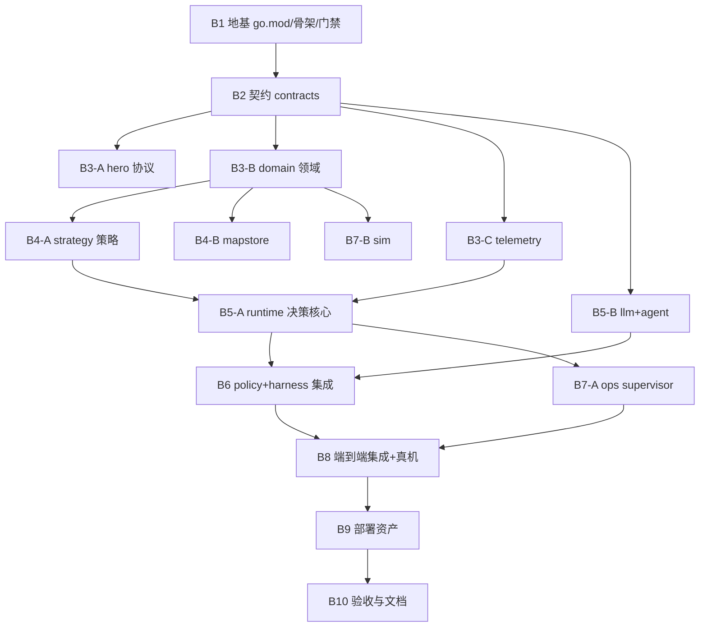

# 编排计划（05）

> 状态：设计定稿。批次、并行 lane、验收顺序与 agent 派发模型。
> 总原则：依赖正确先行、独立模块并行、每批独立验收、高风险批强制独立审查。

## 1. 批次总览与依赖图

| 批次 | 内容 | 并行 lane | 依赖 | 审查 |
|---|---|---|---|---|
| B1 | go.mod、目录、门禁脚本、CI 骨架、version 包 | — | — | L2 |
| B2 | contracts 全量 + 黄金对齐测试 | — | B1 | **L3** |
| B3 | hero / domain / telemetry 三路并行 | 3 lanes | B2 | hero/domain **L3**，telemetry L2 |
| B4 | strategy / mapstore 两路并行 | 2 lanes | B3-B | strategy **L3** |
| B5 | runtime / (llm+agent) 两路并行 | 2 lanes | B4-A + B3-C / B2 | 两路均 **L3** |
| B6 | policy + harness 工具集成到 runtime | — | B5 | **L3** |
| B7 | ops / sim 两路并行 | 2 lanes | B5-A / B3-B | ops **L3**，sim L2 |
| B8 | cmd/arena 全子命令、fixture 全量回放、差分、真机 t3/t4 doctor+shadow | — | B6+B7 | **L3**（差分结论） |
| B9 | Dockerfile、systemd 适配、rollback、CI release job | — | B8 | L2 |
| B10 | 全门禁复跑、覆盖率、文档收尾、进度归档 | — | B9 | L2 |

## 2. 验收顺序（每批固定流程）

1. **L1 机器验证**：执行该批规格声明的门禁命令（`go test -race ./...` 等），
   失败即打回（执行者自检，防"没跑就说绿"）；
2. **L2 diff 审查**：管理者本人逐文件读 diff，对照 `03-module-spec.md` 验收标准核对；
3. **L3 独立审查**（仅标 L3 批次）：code-reviewer 独立审，裁决 APPROVED/FIXED/ESCALATE，
   只合并 APPROVED/FIXED；
4. **批内合流**：合并到 `feature/go-macro-policy`，跑全量门禁，更新 `docs/go/06-progress.md`
   计数与差异日志；
5. **telemetry**：记录每批实际用例数/覆盖率/耗时，与规划比对（漂移 ≥20% 标记，
   ≥40% 重排批次，≥60% 重新规划范围）。

## 3. Agent 派发模型（leader 规则）

- **B1/B10**：管理者直做（Tier 0）；
- **B2、B3-A、B3-B、B4-A、B5-A、B5-B、B6、B7-A**：单执行者（Tier 1），每份完整任务书
  含：目标、模块规格引用、验收命令、防作弊条款、`PROGRESS.md` 机制；
- **B3-C、B4-B、B7-B**：单执行者（Tier 1，文件集与其他 lane 不相交）；
- 并行 lane 之间**地界不重叠**（包目录唯一归属），共享写入点（go.mod/go.sum）只在
  B1 由管理者定稿，各 lane 不得改动依赖；若 lane 发现必须加依赖 → 记 BLOCKED 交回，
  由管理者统一处理后再放行；
- 执行者不创建 PR/不合并分支；全部由管理者合流（single writer 原则）。

## 4. 每批任务书要点（派发时展开）

| 批 | 任务书必含 |
|---|---|
| B1 | 目录树、门禁脚本内容、CI yaml 骨架、`version` 包、`arena version` 命令 |
| B2 | JSON Schema 文件路径清单、结构体映射表、golden 样例要求、枚举全集 |
| B3-A | 主工作区 SDK 参照路径（`D:/Code/Projects/arena/packages/arena-hero-ts/`）、fake WS server 测试要求 |
| B3-B | fixture 路径、reducer 字段映射表、nav invariant、期望导出流程 |
| B3-C | JSONL 格式样本（从主工作区 `runtime/**/telemetry/*.jsonl` 取样）、脱敏规则 |
| B4-A | TS 版 safety/deterministic 语义（从主工作区源码对照）、policy 值域表 |
| B4-B | WAL/busy_timeout/revision 语义、双进程测试要求 |
| B5-A | lease 三重校验、暗卷清单（20+）、FakeClock |
| B5-B | SSE 协议细节、熔断状态机、工具循环、abort 复用 |
| B6 | MacroPolicy prompt 文本对照、parse 全用例、harness 与 Lease 对接接口 |
| B7-A | 锁 PID/starttime 语义、双平台 kill、health/ready 契约（从 deploy/systemd 单元提取） |
| B7-B | fixture events 回放、结算顺序、未知项标注规则 |
| B8 | 回放/差分工具、真机命令、证据文件要求（不落 token） |
| B9 | 镜像 <50MB、systemd 单元适配、rollback 兼容 |

## 5. 关键里程碑

| 里程碑 | 达成条件 | 预计批次 |
|---|---|---|
| M1 地基 | B1+B2 合流，全门禁绿 | B1-B2 |
| M2 领域对等 | domain reducer 100-tick 回放 state 一致 | B3 |
| M3 策略对等 | planner 输出与 TS 期望一致 | B4 |
| M4 决策核心 | 20+ 暗卷全过、never-settle 等值 | B5 |
| M5 Agent 完整 | harness 全链路 + MacroPolicy 对等 | B6 |
| M6 可运行 | cmd 全子命令 + 真机 doctor/shadow 过 | B8 |
| M7 生产形态 | 镜像 + systemd + CI 全绿 | B9 |
| M8 验收完成 | 全门禁 + t3/t4 证据 + 文档归档 | B10 |

## 6. 风险与止损

- **行为漂移**：B3/B4/B6 差分门禁前置；差异日志即时记录，不累积；
- **依赖冲突**：go.mod 仅 B1 定稿；lane 需依赖 → BLOCKED 机制；
- **单批超时**：每批 ≤ 一个执行者会话；超限拆批（B3 已拆 3 lane 预防）；
- **真机不可用**：t3/t4 连接失败 → 回退 fixture 回放验收，真机步骤顺延并报备用户；
- **同一验收连败 3 次**：停下换项/报备，不硬闯。
