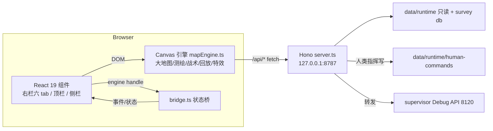

# 指挥面板架构与质量门（ARCHITECTURE.md）

> 更新：2026-08-08。本文记录系统架构、视觉单一源、官方子集映射、质量门与接力清单，
> 供后续 agent/人类快速对齐。指针优先，细节在代码/README/DESIGN。

## 1. 系统架构



- 前端：React 19 + Vite 8 + TS；引擎为命令行式 Canvas（`web/src/engine/mapEngine.ts`，
  已全量类型化 409→0 错误）。
- 后端：Hono（Node 24 type stripping），静态服务 `web/dist`（`/app/*`）+ `public/` 素材。
- 数据流：3s poll 世界快照 + 决策流；15s tick 读条；单位跨 tick 插值动画。
- 只读边界：面板不写运行时；唯一写通道是人类指挥 `/api/command*`。

## 2. 视觉单一源

| 层 | 文件 | 职责 |
|---|---|---|
| 设计 token SSOT | `public/style.css` `:root` | 颜色/字体/圆角/阴影/动效 token |
| React 附加 | `web/src/styles/theme.css` | 仅 React 布局 + feature-panel（49 行，无同名冲突） |
| 引擎画布 | `mapEngine.ts` | canvas 绘制（语义色已对齐 CSS token，2026-08-08） |

- `main.tsx` 经 vite 把 `style.css` + `theme.css` 统一打进 dist —— 单一视觉源成立。
- 引擎语义色已对齐 CSS token（success/warn/cyan，2026-08-08）；`public/style.css` 残留旧色已清理（7055b22）。

## 3. 官方子集映射（arena-hero-web → 本面板）

| 官方组件 | 本面板对应 | 状态 |
|---|---|---|
| GameHUD / GameStats | fleetHud + commandCountdown | ✅ |
| UnitActionDialog | actionDialog（动作卡，右键/选中） | ✅ |
| PendingCommands | pendingPanel（待执行命令） | ✅ |
| CommandCountdown | commandCountdown（命令窗口倒计时） | ✅ |
| MapFeatureInfo | featurePanel（信标/资源/障碍详情） | ✅ |
| BeaconDirectionIndicator | beaconIndicator + beaconEdge 图层 | ✅ |
| RespawnOverlay | respawnOverlay | ✅ |
| ResourceActivity | resourceActivity | ✅ |
| AssetList | assetPanel（舰队索引） | ✅ |
| MapControls | mapControls（缩放/适应/全局） | ✅ |
| WorldCanvas | mapEngine canvas | ✅ |
| account/（API keys/GitHub） | 不需要（本地只读 + 兑换码 Cookie） | ⏭ |

官方 `lib/` 逻辑映射（2026-08-08 核对）：

| 官方 lib | 本面板对应 | 状态 |
|---|---|---|
| combatAnimation / combatPreview | tactDrawEventFx + drawResolvedShotFx/SweepFx + debris 碎片（SHOT_HIT/MISSED/SWEEP_RESOLVED/CORE_DESTROYED） | ✅ |
| movementAnimation / movementPreview | drawMovementDashes（起点/终点/虚线/箭头）+ routePreview 悬停预览 | ✅ |
| pathfinding | tactFindPath（BFS + 测绘记忆障碍合并） | ✅ |
| commandPlans | plan 层（tactPlanLayer + 意图标签 + drawHumanGoalPaths） | ✅ |
| exploration / visibility | tactSurveyLayer（测绘记忆 + 新鲜度淡出）+ 敌情记忆（drawEnemyMemory） | ✅ |
| destruction | CORE_DESTROYED 扩散环 + 碎片外抛物理 | ✅ |
| resourceActivity / statArt | 资源活动面板 + 消费条形图 | ✅ |
| beaconArt / obstacleArt / unitArt / worldArt | SPRITE 精灵映射 + 画布绘制 | ✅ |
| gameRules / actionAvailability | tactActionTypes + tactAvailability（动作可用性） | ✅ |

## 4. 质量门（生产级稳定基线）

```bash
npm run check:all          # server tsc → 联盟同步护栏 → web typecheck → web build 一键全绿
npm run test:regression    # Playwright 回归 22 项（web/scripts/cc-regression.mjs）
```

- 回归覆盖：页面零错误 / 六 tab / 威胁玫瑰 / 决策流 / 聚焦 HUD / 计划层像素 /
  人类指挥链（goal 落盘）/ 跳图定位标记 jumpPins / 手操审计 UI / 15s tick 读条 / 右键指挥菜单 /
  编队多选（Shift 加选）/ 命令队列（MOVE 模式 Shift 入队）/ API 健康。
- 相机稳定辅助 waitViewStable：F 适应/跳图后轮询 view 两次采样一致再算坐标（消 flaky）。
- 全局 240s 硬超时：服务重启/高负载时不无限卡，强制打印部分结果退出。
- 联盟同步护栏 `check:alliance-sync`：diff lib/alliance 与 arena-agent/src/alliance，漂移即失败。
- 2026-08-08 实测：console 全量审计零 warning/error；压力交互（快速切 tab/缩放/跳图）零 JS 错误。
- 临时 build 验证（不部署）：`vite build --outDir <tmp>`，确认新代码 + 新 token 打包正确。

## 5. 人类指挥（默认 agent 全自动，人工最高控制权）

- 选中单位 → 动作卡：移动（点矿=采矿任务/点空地=移动任务）、清扫、攻击、采集、回仓、拾取/放置信标、自毁、等待。
- 提交经 `/api/command*` → `data/runtime/human-commands/<tenant>.json`，tenant 主循环合并前覆盖 agent 决策。
- 地图动线：人类指令 mine=琥珀 / goto=青，agent 规划=绿；jumpPins 跳图定位标记（点击/Esc 清除）。

## 6. 接力清单（并行重构提交后）

1. **build + 回归 ✅（2026-08-08）**：`npm run check:all` 全绿（server tsc 0 错 + web typecheck 0 错 + build）；
   `npm run test:regression` **18/18 全绿**（含前置健康/六 tab/威胁玫瑰/决策流/HUD/计划层/人类指挥链/jumpPins/手操审计/API）。
2. **引擎颜色对齐 ✅（2026-08-08，本轮提交）**：`mapEngine.ts` 语义色已对齐新 token——
   success `#7fd8a5→#8fce9f`、warn/信标 `#e0b94f→#f0883e`（含 rgba 环）、cyanSignal `#1fe0ca→#5fd4e8`。
3. **回归脚本适配**：组件重构若改选择器/类名，回归需跟随（data-rp-tab/tenant-card 等通用选择器优先）。
   **健壮化 ✅（1004faa）**：前置健康改 `node:http` 直连（绕 HTTP_PROXY/undici 劫持）；失败打印结果后退出（不再被 `return` 吞输出）；
   人类指挥链点击后轮询等落盘（≤4s）消 flaky。
4. **jumpPins 命中排除 shift ✅（2026-08-08）**：`handleCanvasClick` 已补 `!shift`——Shift+点 pin 不进清除，走框选。
5. **手操审计 UI 上线 ✅（`1cbc5ef`）**：SituationPanel「HUMAN AUDIT」区块已随 dist 生效。
6. **arena-agent 迁移收尾 ✅（2026-08-08，`3f3290c`）**：联盟纯函数从 git HEAD 复制进
   `lib/alliance/`（snapshot/shared-intel/sightings/threat-summary/types/counts/roster/threat-field/control-types 共 9 文件），
   `lib/alliance-snapshot.ts` 5 处 import 改 `./alliance/*`，server tsc 恢复、面板已重启（pid 44952）。
   **遗留（并行 agent 收尾）**：arena-agent/arena-hero-ts 包删除 + 根 `package.json` workspaces/CI 同步未提交——
   root workspaces 仍引用这两个包，删除未提交前勿动。
7. **人类指挥链修复 ✅（1004faa）**：MOVE 点击目标非实时障碍必提交——测绘记忆寻路失败不再吞命令
   （服务端权威导航）；实时障碍才 toast 拒绝。修复"点了没反应"类交互。
8. **全局旧色残留清理 ✅（7055b22）**：`public/style.css` 信标渐变/HP 条/tick 信号青统一到 DESIGN token。
9. **人类指挥意图线验证 ✅（2026-08-08）**：`drawHumanGoalPaths` + `tactDrawRoute` 已实现且实测通过——
   发布 goto goal 后 ≤3s（poll 周期）canvas 出现青色 #5fd4e8 完整寻路路径（首步实线/未来步虚线/方向箭头/
   目标旗/行进脉冲）；mine=白、goto=青、agent 规划=绿，命令被服务端对账清理后自然消失。

10. **脚本全 TS 化 ✅（581ffab/045687e，2026-08-08）**：command-center 4 个 mjs（cc-regression/
    check-alliance-sync/start-cc/survey-server）+ root 2 个（healthcheck/check-shared-schemas）→ .ts。
    Node 24 type stripping（type:module）或 tsx（root 无 type:module，top-level await 包进 async main）运行；
    tsconfig include 覆盖 scripts/test/survey-server（strict 0 错误）；cc-regression 为 Playwright e2e 加 @ts-nocheck。
    **收尾 ✅（2026-08-08）**：arena-agent check-sim-isolation（4948ef9）+ arena-hero-ts generate-schemas（本次）→ .ts，
    全仓自有脚本 mjs 清零；arena-agent 71 个 .mts 为 TS 官方 ESM（tsx 跑），合规保留。
10. **单位/核心实时命中 ✅（2026-08-08）**：handleCanvasClick 命中不再只依赖合并地图
    3s 轮询的 cellIndex——tick 边界单位移位后点击落空且静默 tactClear（"点了没反应"
    根因，编队多选/右键菜单 flaky 同源）。现在命中单位/核心格时按点击世界坐标用
    live world（tactLoadWorld(force)）重定位；完全无命中时用聚焦租户 live world 兜底
    （覆盖刚出生/刚移位尚未进 cells 的单位）。命中加 1 格切比雪夫容差（tactObjectNear，r=1）；右键 openCtxMenu 同源校正（async + live 命中）。回归加固：/api/world 拉取重试 + toast/右键菜单/队列轮询等待 + 硬超时 300s；面板点击穿透（.action-dialog/.inspect-panel/.feature-panel 非交互区 pointer-events:none，"卡片挡住选点"根治）。实测 21/21 全绿。
9. **临时脚本清理**：web/ 下临时 *.mjs 用完即删（当前无遗留）。


