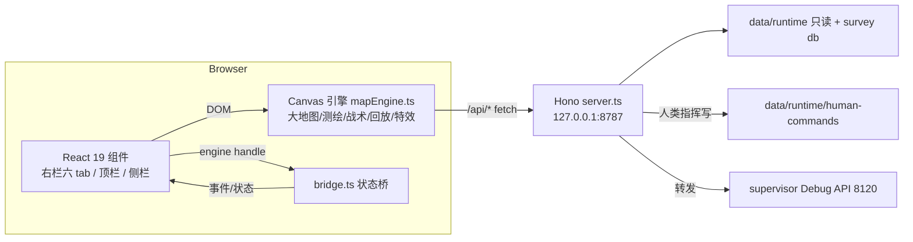

# 指挥面板架构与质量门（ARCHITECTURE.md）

> 更新：2026-08-08。本文记录系统架构、视觉单一源、官方子集映射、质量门与接力清单，
> 供后续 agent/人类快速对齐。指针优先，细节在代码/README/DESIGN。

## 1. 系统架构



- 前端：React 19 + Vite 8 + TS；引擎为命令行式 Canvas（`web/src/engine/mapEngine.ts`，
  已全量类型化 409→0 错误）。
- 后端：Hono（Node 24 type stripping），静态服务 `web/dist`（`/app/*`）+ `public/` 素材。
- 数据流：3s poll 世界快照 + 决策流；15s tick 读条；单位跨 tick 插值动画。
- 只读边界：面板不写运行时；唯一写通道是人类指挥 `/api/command*`。

## 2. 视觉单一源

| 层 | 文件 | 职责 |
|---|---|---|
| 设计 token SSOT | `public/style.css` `:root` | 颜色/字体/圆角/阴影/动效 token |
| React 附加 | `web/src/styles/theme.css` | 仅 React 布局 + feature-panel（49 行，无同名冲突） |
| 引擎画布 | `mapEngine.ts` | canvas 绘制（当前为硬编码语义色，**待对齐 CSS token**） |

- `main.tsx` 经 vite 把 `style.css` + `theme.css` 统一打进 dist —— 单一视觉源成立。
- 引擎语义色与 CSS 尚未单一源（见 §6 接力清单）。

## 3. 官方子集映射（arena-hero-web → 本面板）

| 官方组件 | 本面板对应 | 状态 |
|---|---|---|
| GameHUD / GameStats | fleetHud + commandCountdown | ✅ |
| UnitActionDialog | actionDialog（动作卡，右键/选中） | ✅ |
| PendingCommands | pendingPanel（待执行命令） | ✅ |
| CommandCountdown | commandCountdown（命令窗口倒计时） | ✅ |
| MapFeatureInfo | featurePanel（信标/资源/障碍详情） | ✅ |
| BeaconDirectionIndicator | beaconIndicator + beaconEdge 图层 | ✅ |
| RespawnOverlay | respawnOverlay | ✅ |
| ResourceActivity | resourceActivity | ✅ |
| AssetList | assetPanel（舰队索引） | ✅ |
| MapControls | mapControls（缩放/适应/全局） | ✅ |
| WorldCanvas | mapEngine canvas | ✅ |
| account/（API keys/GitHub） | 不需要（本地只读 + 兑换码 Cookie） | ⏭ |

## 4. 质量门（生产级稳定基线）

```bash
npm run check:all          # server tsc → web typecheck → web build 一键全绿
npm run test:regression    # Playwright 回归 16 项（web/scripts/cc-regression.mjs）
```

- 回归覆盖：页面零错误 / 六 tab / 威胁玫瑰 / 决策流 / 聚焦 HUD / 计划层像素 /
  人类指挥链（goal 落盘）/ 跳图定位标记 jumpPins / API 健康。
- 2026-08-08 实测：console 全量审计零 warning/error；压力交互（快速切 tab/缩放/跳图）零 JS 错误。
- 临时 build 验证（不部署）：`vite build --outDir <tmp>`，确认新代码 + 新 token 打包正确。

## 5. 人类指挥（默认 agent 全自动，人工最高控制权）

- 选中单位 → 动作卡：移动（点矿=采矿任务/点空地=移动任务）、清扫、攻击、采集、回仓、拾取/放置信标、自毁、等待。
- 提交经 `/api/command*` → `data/runtime/human-commands/<tenant>.json`，tenant 主循环合并前覆盖 agent 决策。
- 地图动线：人类指令 mine=琥珀 / goto=青，agent 规划=绿；jumpPins 跳图定位标记（点击/Esc 清除）。

## 6. 接力清单（并行重构提交后）

1. **build + 回归**：`npm run check:all`（含 build 覆盖 dist）→ `npm run test:regression`，
   确认 achromatic 新视觉不破坏 16 项。
2. **引擎颜色对齐**：`mapEngine.ts` 残留旧板 `#7fd8a5`(success ×11) `#d9a62e`/`#e0b94f`(amber)
   `#1fe0ca`(cyanSignal) —— 对齐 CSS 新 token（success `#8fce9f`、amber `#f0883e` 等），
   或改为读 CSS 变量（单一源）。
3. **回归脚本适配**：组件重构若改选择器/类名，回归需跟随（data-rp-tab/tenant-card 等通用选择器优先）。
4. **jumpPins 命中排除 shift**：handleCanvasClick 已加 shift 参数（框选），jumpPins 点击命中需补 `!shift`（Shift+点 pin 不应清 pin 而应多选）。
5. **手操审计 UI 上线**：SituationPanel「HUMAN AUDIT」区块复用 .sit-sight 结构，build 后随 dist 生效；回归可加断言。
6. **arena-agent 迁移观察（2026-08-08）**：并行 agent 全量删除 arena-agent/arena-hero-ts 包并正在把联盟逻辑迁入
   command-center（alliance-survey.ts 已改租户色统一 muted）。迁移完成需验证：
   `lib/alliance-snapshot.ts` 的 `../../arena-agent/src/alliance/*` import 是否已内联/改路径，server tsc 恢复。
4. **临时脚本清理**：web/ 下临时 *.mjs 用完即删（当前无遗留）。
