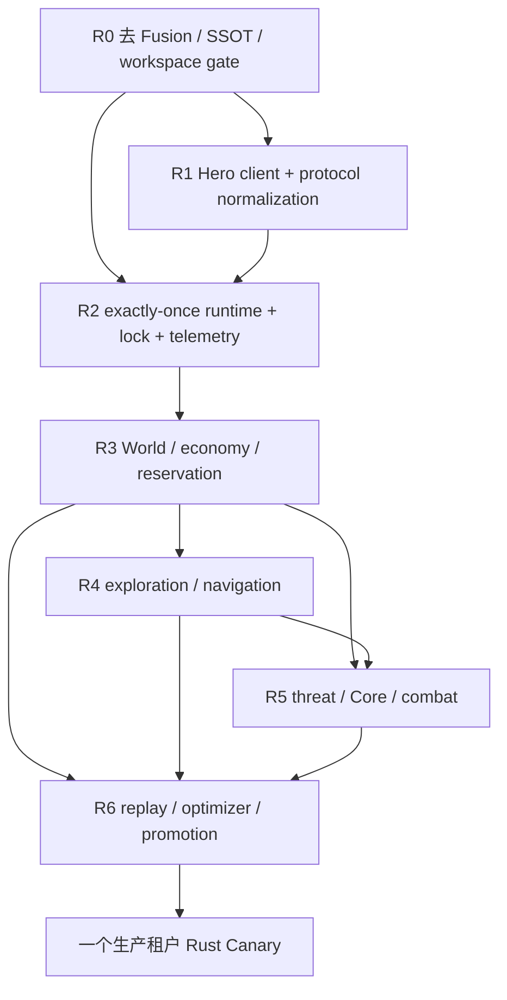
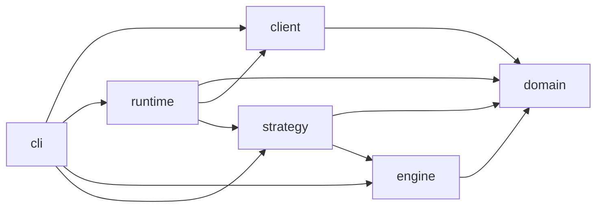

# Pure Rust 依赖图与并行编排

## 1. 阶段依赖



R1 与 R2 可以部分并行，但 runtime 只能依赖稳定的 client/domain 接口。R3 之前必须完成真实 Tick exactly-once 与 fail-closed，避免在不安全运行时上堆策略。

## 2. Crate 依赖方向



禁止反向依赖：

- `domain` 不依赖网络、runtime、CLI；
- `engine` 不依赖 client/runtime；
- `strategy` 不依赖 Hero transport；
- `client` 不依赖 strategy；
- simulator 不导入 live submit/lock 副作用；
- 不存在 FFI crate 连接 Go Host。

## 3. 可并行 lanes

### Lane A — Client / Protocol

文件地界：

```text
crates/client/**
protocol fixtures
client-specific tests
```

负责 auth、HTTP、WS、DTO、normalization、reconnect。

### Lane B — Runtime / Ops

文件地界：

```text
crates/runtime/**
runtime-specific tests
run manifest / JSONL implementation
```

负责 exactly-once、single writer、deadline、submit orchestration、telemetry、shutdown。

### Lane C — Strategy / Simulation

文件地界：

```text
crates/strategy/**
crates/engine/**（单 owner）
strategy scenarios/tests
```

负责 World、经济、探索、导航、威胁和战斗。

## 4. 单 owner 接缝

以下路径同时只能由一个 Agent 修改：

- `crates/domain/**`；
- workspace `Cargo.toml` / `Cargo.lock`；
- canonical scenario/profile/result schema；
- `sim-rs/PROGRESS.md`；
- Rust CLI command registry；
- production tenant config。

需要新字段时先提交最小 domain/client contract，再让各 lane 接线；禁止三路同时改 schema。

## 5. 合流顺序

```text
lane 原子提交
→ lane 局部测试
→ rebase 当前 rust-rewrite
→ workspace fmt/clippy/test
→ deterministic replay
→ 更新 PROGRESS 事实与证据
→ 下一任务
```

不得在一个合流提交混入：

- protocol 重构；
- planner 行为变化；
- golden 更新；
- unrelated cleanup。

## 6. 当前批次

| Batch | 目标 | 任务 |
|---|---|---|
| B0 | 去 Fusion | 文档/SSOT、legacy 盘点、workspace gate |
| B1 | Read-only vertical slice | client DTO/WS + shadow CLI |
| B2 | Safe runtime | exactly-once/lock/telemetry/fatal errors |
| B3 | Economic loop | memory/assignment/deposit/spawn/reservation |
| B4 | Exploration and threat | map/navigation/enemy/Core |
| B5 | Combat and optimizer | combat/replay/search/promotion |
| B6 | Production migration | t3/t4 canary → one t1/t2 → second tenant |

## 7. 止损规则

- R1/R2 红时停止新增策略模块；
- 同一验收连续失败三次，先缩小 fixture/接口，不横向补丁；
- 结果变差先回滚 candidate，不改 scorer/golden 掩盖；
- 发现 Go/FFI 依赖时登记并原生迁移，不继续完善旧接缝；
- live 出现 hard gate，立即退回 shadow；
- 本机 live/calibration 进程优先，实验只杀匹配 PID。
