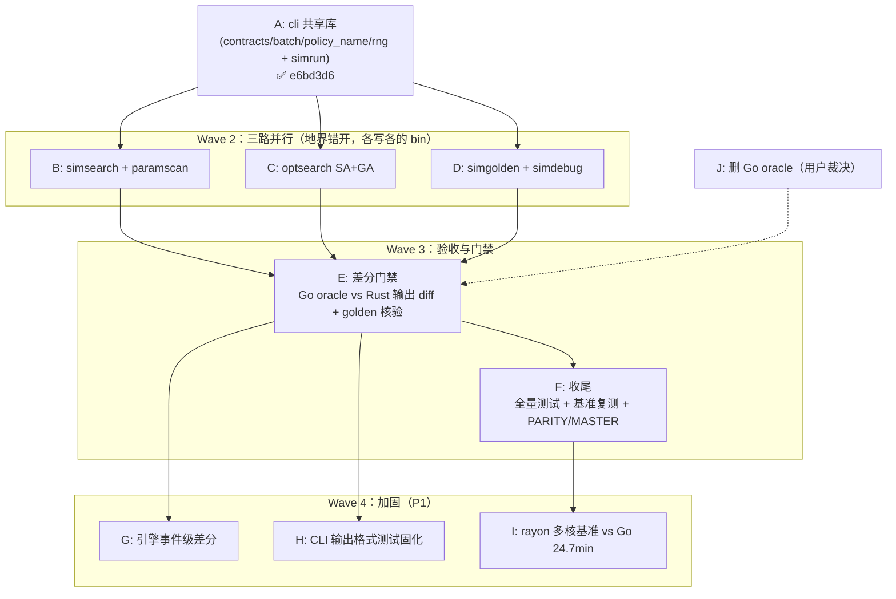

# 依赖图与并行编排（rust-rewrite 分析线）

## 依赖图（Mermaid）

## 并行编排说明

- **接缝**：任务 A 的共享库 API（batch/contracts/policy_name/rng）是全部下游的地基，冻结后 B/C/D 可完全并行
- **地界**：B/C/D 各只写自己的 bin 文件；tests 目录共享但按文件归属，冲突概率低
- **共享写入点**：`runtime/golden.json` 唯一归属任务 D（simgolden --update）；Cargo.lock 归属任务 A（已锁定）
- **合并风险**：B/C/D 三路并行，合并排队变慢是新常态，不自行协调
- **取证纪律**：B 的证据经过 C 的战场只列存疑不动；执行线提交后重跑取证

## 批次规划（Delivery Batches）

| 批次 | 目标 | 任务 | 说明 |
|---|---|---|---|
| Batch 1 | CLI 平台地基 | A | ✅ 已完成并提交 |
| Batch 2 | 6 CLI 全对偶 | B, C, D | 执行线产物，提交后复核 |
| Batch 3 | 语义对齐门禁 | E, F | 差分绿 = 重写线核心验收 |
| Batch 4 | 加固 | G, H, I | P1，可延后 |
| Batch 5 | 清理 | J | 用户裁决（keep_oracle 约定：差分全绿后再删） |
